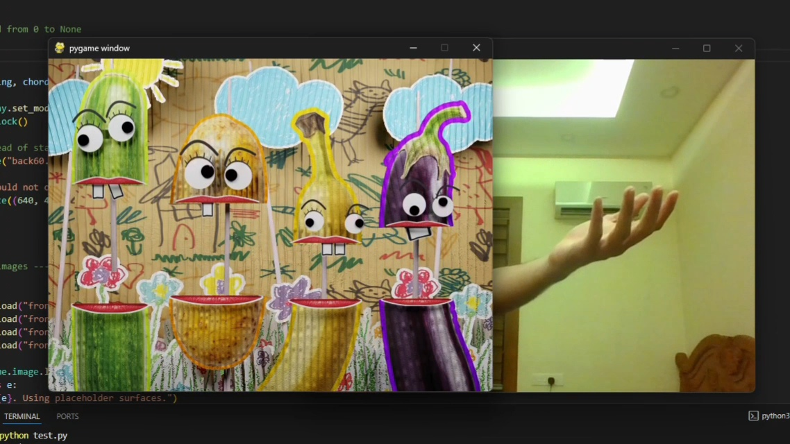

# Orchest-Rawww-

**Orchest-Rawww-** is a fun and interactive music experiment where fruits and vegetables form a chaotic orchestra!  
The project combines real-time hand gesture recognition, procedural sound generation, and playful animation — all driven by Python. 🍌🥕🥦🎺  

---

##  Concept

The goal was to create a funny and creative orchestra made entirely of fruits and vegetables.  
Each gesture controls part of the “performance,” triggering sounds and animations in real time.  
It’s a mix of humor, music, and motion — a small passion project exploring art and tech together.

---

##  Tech Stack

- ** Python** – Core logic and orchestration  
- ** Pygame** – Handles input/output and the main application loop  
- ** OpenCV** – Real-time hand gesture recognition and tracking  
- ** FluidSynth** – High-quality, real-time audio synthesis  
- ** Blender** – Asset creation and visual design  

---

##  Preview





---

##  How to Run

1. Install dependencies:
   ```bash
   pip install pygame opencv-python pyfluidsynth

2. Place the **tools** folder into this location:  
    > ```
    > C:\
    > ```

    > (So the full path becomes `C:\tools\fluidsynth`)

